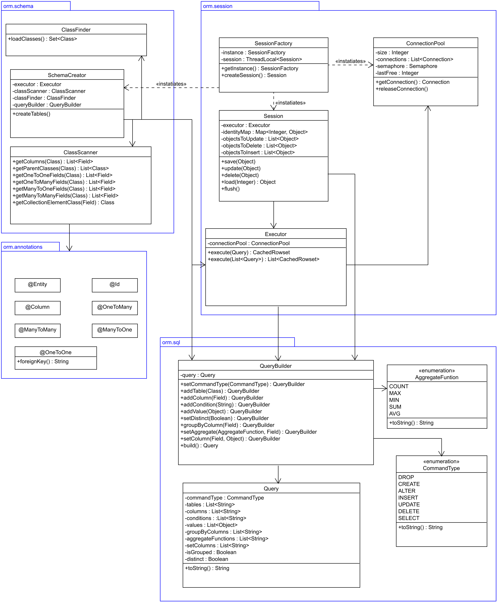

<div text-align="center"><h1>Framework realizujący mapowanie OR klas w języku Java</h1></div>
<p align=center>Piotr Makarewicz, Gabriel Kępka, Adrian Jabłoński, Paweł Hołowicki</p>

## 1. Opis biblioteki
Framework realizuje podstawowe mapowanie obiektowo-relacyjne, pozwala na wykonywanie operacji CRUD na obiektach utrwalając ich stan w bazie danych lub 
odczytując je z niej, określanie relacji między obiektami różnych klas (One to One, One to Many, Many to Many) oraz obsługę dziedziczenia. 
Wykorzystuje mechanizm adnotacji, pozwalając oznaczyć jakie klasy mają być persystowane w bazie danych, wartości których pól mają być zapisywane oraz określić relacje między różnymi obiektami.
Pakiety zawierające klasy modelu dziedzinowego są określone w pliku konfiguracyjnym.

## 2. Użyte technologie  
- Java
- MySQL


## 3. Architektura fizyczna


Framework umożliwia persystencję danych z jednego komputera na jednej bazie danych.

## 4. Architektura logiczna


Framework zakłada istnienie jednego modelu dziedzinowego w aplikacji korzystającej z niego. Do tego modelu należą wszystkie klasy aplikacji, które posiadają adnotację *@Entity*. Jeżeli aplikacja działa wielowątkowo, wówczas każdy wątek tworzy osobny obiekt klasy *Session*. Każdy obiekt z klasy *Session* posiada obiekt klasy *Executor*, który służy do wykonywania poleceń SQL. Na czas wykonania polecenia SQL *Executor* pobiera z *ConnectionPool* połączenie z bazą danych i zwraca je, gdy skończy wykonywać polecenie.

## 5. Diagram modułów biblioteki

<div text-align="center" width=66%></div>

## 6. Moduły

### 6.1. orm.session


Klasy:
 - *Session* - Główna klasa frameworku. Posiada listy obiektów do dodania do bazy danych, modyfikacji i usunięcia, realizując w ten sposób wzorzec **Unit of Work**. Oprócz tego zawiera mapę *identityMap*, w której kluczami są identyfikatory, a wartościami obiekty załadowane z bazy danych, zgodnie z wzorcem **Identity Map**. Metody klasy *Session* są wywoływane przez aplikację korzystającą z frameworka:
   - *flush()* - zatwierdza zmiany; sprawia, że dla obiektów na listach Unit of Work są wykonywane odpowiednie czynności. Tworzy z pomocą *QueryBuilder* obiekt zapytania *Query*, który następnie przekazuje do obiektu *executor*
   - *save()* - dodaje obiekt do listy *objectsToInsert*
   - *update()* - dodaje obiekt do listy *objectsToUpdate*
   - *delete()* - dodaje obiekt do listy *objectsToDelete*
   - *load()* - pobiera obiekt z bazy danych lub z *identityMap*
 - *SessionFactory* - odpowiada za tworzenie obiektów klasy *Session*, realizując w ten sposób wzorzec **Factory**. Zapewnia, że jeden wątek może mieć tylko jeden obiekt klasy *Session*, zapisując referencję na ten obiekt w zmiennej typu *ThreadLocal\<Session\>*. W aplikacji może istnieć tylko jeden obiekt *SessionFactory*, jest więc tu wykorzystany wzorzec **Singleton**. Pierwsze wywołanie metody *getInstance()* sprawia że SessionFactory uruchamia metodę *createTables()* klasy *SchemaCreator* i inicjalizuje pulę połączeń w klasie *ConnectionPool*.
 - *Executor* - Wykonuje przygotowane wcześniej zapytania SQL. W każdym wywołaniu metody *execute()* pobiera z *ConnectionPool* wolne połączenie, wykonuje zapytania, zatwierdza transakcję i zwraca połączenie do *ConnectionPool*.
 - *ConnectionPool* - Przechowuje i udostępnia pulę połączeń z bazą danych. Liczebność puli jest specyfikowana w pliku konfiguracyjnym. W celu zarządzania dostępem do puli w programach wielowątkowych stosuje semafor licznikowy. Realizuje wzorzec projektowy **Connection Pool**.

### 6.2. orm.schema


**Klasy:**
 - *SchemaCreator* - Dla klas podanych w pliku konfiguracyjnym tworzy odpowiednie tabele w bazie danych
 - *ClassScanner* - Wykonuje refleksję na klasach i zwraca pola z odpowiednimi adnotacjami
 - *ClassFinder* - Przeszukuje pakiety w poszukiwaniu klas z adnotacją *@Entity*

### 6.3. orm.sql


**Klasy:**
 - *QueryBuilder* - udostępnia metody pomagające tworzyć obiekt *Query*, realizując w ten sposób wzorzec **Builder**
 - *Query* - przechowuje elementy zapytania SQL, umożliwia stworzenie kodu SQL na podstawie tych elementów

**Typy wyliczeniowe:**
 - *AggregateFunction* - reprezentuje funkcję agregującą w zapytaniu SQL
 - *CommandType* - reprezentuje typ zapytania SQL

### 6.4. orm.annotations


**Adnotacje:**
 - *@Entity* - adnotacja klasy repezentującej encję, dla każdej z tak oznaczonych klas *SchemaCreator* tworzy osobną tabelę w bazie danych
 - *@Id* - adnotacja pola reprezentującego klucz główny rekordu w bazie danych, zgodnie z wzorcem **Identity Field**. Klucz ten jest unikalny nie tylko w skali tabeli, ale w skali całej bazy danych.
 - *@Column* - adnotacja pola reprezentującego kolumnę w bazie danych.
 - *@OneToOne* - adnotacja pola z referencją na obiekt, z którym obecny obiekt jest w relacji jeden-do-jeden. Argument *foreignKey* o możliwych wartościach `"this"` lub `"other"` decyduje, czy klucz obcy zostanie umieszczony w tabeli tego obiektu lub drugiego obiektu w relacji.
 - *@OneToMany* - adnotacja pola z referencją na obiekt, z którym obecny obiekt jest w relacji jeden-do-wiele.
 - *@ManyToOne* - adnotacja pola z referencją na obiekt, z którym obecny obiekt jest w relacji wiele-do-jednego.
 - *@ManyToMany* - adnotacja pola z referencją na obiekt, z którym obecny obiekt jest w relacji wiele-do-wiele.

## 7. Zastosowane wzorce projektowe

### 7.1. Unit of Work

```
<miejsce na diagram klas, które realizują ten wzorzec>
```

Klasa *Session* utrzymuje trzy zbiory: obiektów do aktualizacji, obiektów do dodania oraz obiektów do usunięcia. Unit of Work pozwoli na optymalizację transakcji przez usunięcie operacji redundantnych i zwiększenie wydajności systemu.

### 7.2. Identity Field

Każdy obiekt, odpowiadający rekordowi w bazie, posiada własne unikalne id. W bazie istnieje tabela, w której przechowywana jest informacja o następnym wolnym id. Nowy obiekt otrzymuje to id, a następnie wcześniej wspomniana tabela jest aktualizowana.

### 7.3. Identity Map

```
<miejsce na diagram klas, które realizują ten wzorzec>
```

miejsce na opis

### 7.4. Class Table Inheritance 


Framework obsługuje dziedziczenie za pomocą wzorca projektowego **Class Table Inheritance**, gdzie dla każdej klasy z osobna tworzy tabele, w której każdy wiersz odpowiada konkretnym polom w danej klasie. 

### 7.5. Foreign Key Mapping

```
<miejsce na diagram klas, które realizują ten wzorzec>
```

Framework obsługuje tworzenie relacji jeden-do-jeden i jeden-do-wielu za pomocą wzorca projektowego **Foreign Key Mapping**.

miejsce na dalszy opis

### 7.6. Association Table Mapping
```
<miejsce na diagram klas, które realizują ten wzorzec>
```

Framework obsługuje tworzenie relacji wiele-do-wielu za pomocą wzorca projektowego **Assotiation Table Mapping**. Tworzy tabelę łącznikową dla każdej pary klas tworzących tę relację.

miejsce na dalszy opis

### 7.7. Factory i Singleton
```
<miejsce na diagram klas, które realizują ten wzorzec>
```

Zaimplementowane razem w klasie SessionFactory. Służą zapewnieniu globalnej kontroli nad obiektami klasy Session. Implementacja Singletona opiera się na *lazy-loading* i podwójnym sprawdzeniu istnienia obiektu w metodzie *getInstance()* w celu zapewnienia bezpieczeństwa w programach wielowątkowych.

miejsce na dalszy opis

### 7.8. Connection Pool
```
<miejsce na diagram klas, które realizują ten wzorzec>
```
W SessionFactory

### 7.9. Builder

```
<miejsce na diagram klas, które realizują ten wzorzec>
```

Służy ułatwieniu tworzenia różnych typów zapytań SQL.

## 8. Plik konfiguracyjny

Pakiety z klasami, których obiekty są persystowane i wielkość ConnectionPool są zapisane w pliku konfiguracyjnym o formacie JSON. Przykładowy plik:

```json
{
    "packages": ["example.package.one", "example.package.two"],
    "connection_pool_size": 10
}

```

## 9. Przykłady użycia biblioteki przez klienta

Klasa reprezentująca encję:
```java
@Entity
public class Person {

    @Id
    private Long id;

    @Column
    private String name;

    public Person() {
    }
}
```

Zapisanie obiektu w bazie:
```java
SessionFactory sessionFactory = SessionFactory.getInstance();
Session session = sessionFactory.createSession();

Person person = new Person();
person.setName(”John”);

session.save(person);
session.flush();
session.close();
```

Załadowanie obiektu z bazy i jego aktualizacja:
```java
SessionFactory sessionFactory = SessionFactory.getInstance();
Session session = sessionFactory.createSession();

Person person = session.load(Person.class, 2);
person.setName(”Json”);

session.update(person);
session.flush();
session.close();
```
